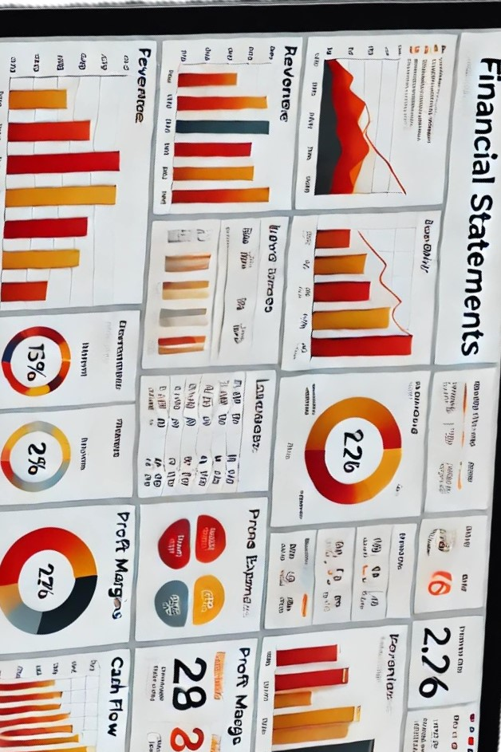
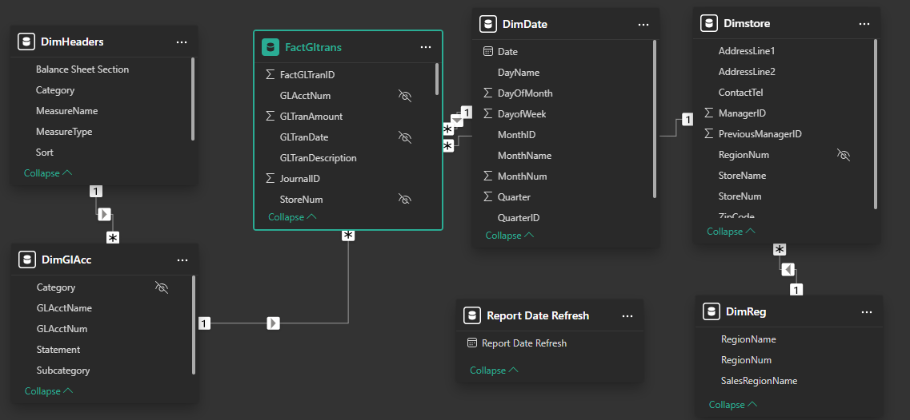
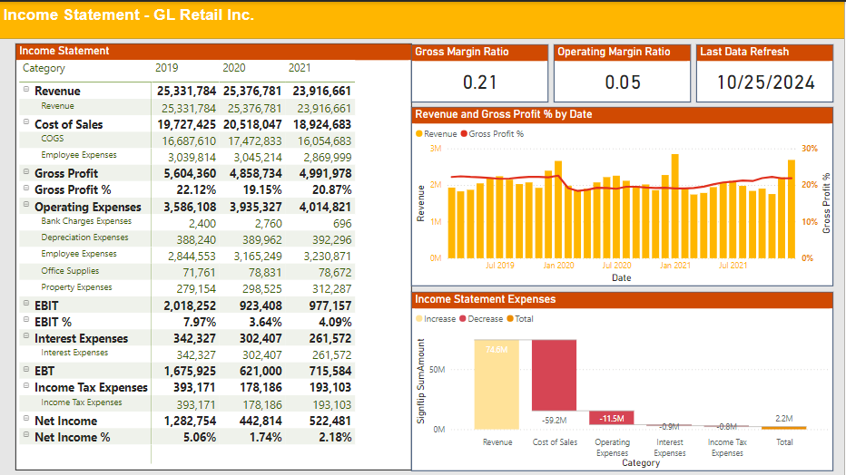
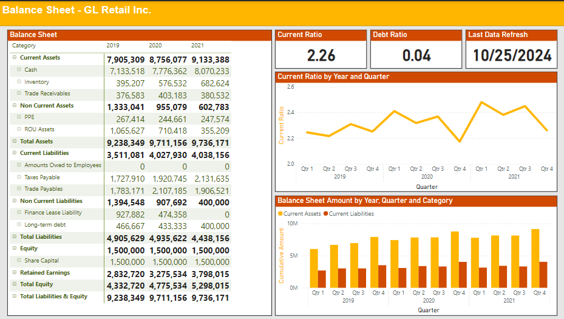

## Financial-Statements-in-power-bi

### Project Overview

Financial data is at the heart of business decision-making, yet static and manual reporting processes often hinder timely and accurate analysis.
Analyzing financial data effectively is critical for organizations to understand their performance and make informed decisions. Traditional financial statements often lack flexibility and interactivity, limiting their usability for dynamic reporting. 
This project addresses these challenges by utilizing Power BI to create a comprehensive and interactive financial statement dashboard. 
By combining SQL for data extraction and transformation with Power BI's visualization tools, this solution aims to enable businesses track critical metrics like revenue, expenses, and profitability in real time, fostering better insights and more agile decision-making.




### Problem Statement

The organization currently relies on manual processes to analyze financial statements, which is time-consuming and potentially error-prone. Financial teams need to regularly track key metrics including Gross Profit %, EBIT %, Net Income %, and the Current Ratio between Current Assets and Current Liabilities. The challenge is to automate this process by developing a Power BI dashboard that directly connects to the company database, providing real-time financial analysis and trend visualization to support faster, more accurate decision-making.

### Data Sources
The financial statement analysis draws from the following primary data sources:
    - SQL Database:
Contains detailed transaction records and account balances
General Ledger (GL) Retail Server maintained by [CFI](https://corporatefinanceinstitute.com)
Queried financial data FactGLTran, GL Accounts, Stores, and Region Tables.
    - Headers Table: [View here](Financial_Statements_Headers_Table.xlsx)
Added an excel  table to format the income statement and balance sheet structure.
    - Used Power Query’s Advanced Editor to create a date table with calculated columns for time intelligence. [View here](Date_Dimension.txt)
    
### ETL (Extract, Transform, Load) Process
Used SQL queries to retrieve all financial data directly from the centralized database from FactGLTran, GL Accounts, Stores, and Region tables.
Created dedicated SQL view to simplify data retrieval and improve query efficiency.
The SQL querry used to retrieve the data and create sql view as a staging . [View SQL Code](GL_Trans_View.sql)
Referenced the SQL view to create tables in Power Query Editor.
Standardized column names and ensured consistent formatting for smooth integration into the Power BI model.

### Data modelling
Create the Fact and Dimension Queries by referencing the Staging Query
Added headers and date diension tables
Established relationships between tables.




### DAX (Data Analysis Expressions)
Use DAX (Data Analysis Expressions) to create key measures such as:

    -  ```Income statement = 
     VAR DISPLAY_FILTER = NOT ISFILTERED(DimGlAcc[Subcategory])
    RETURN
    SWITCH(TRUE(),
    SELECTEDVALUE(DimHeaders[MeasureName]) ="Subtotal" && DISPLAY_FILTER, [I/S Subtotal],
    SELECTEDVALUE(DimHeaders[MeasureName]) = "Per_Of_Revenue"&& DISPLAY_FILTER,  [% Of Revenue],
    [I/S Amount]
    )```
    
That dynamically calculates and determine what kind of financial data to display in each row of the income statement based on the measure name.

   
    - ```Balance Sheet = 
    VAR Display_filter = NOT ISFILTERED(DimGlAcc[Subcategory])
    RETURN
    SWITCH(TRUE(),
    SELECTEDVALUE(DimHeaders[MeasureName]) = "Section_Subtotal" && Display_filter,[B/s Subtotal],
    SELECTEDVALUE(DimHeaders[MeasureName]) = "Retained_earnings" && Display_filter,[Retained earnings],
    SELECTEDVALUE(DimHeaders[MeasureName]) = "Total_Equity" && Display_filter,[Total Equity],
    SELECTEDVALUE(DimHeaders[MeasureName]) = "Total_LE" && Display_filter,[Total Liabilities & Equity],
    [Cumulative Amount])```

That dynamically calculates and determine what kind of financial data to display in each row of the Balance sheet based on the measure name.


### Data analysis
### The Income statement



Detailed Financial Reporting
The analysis focused on the Income Statement to provide a clear picture of the organization's profitability and operational efficiency. Key insights and visualizations developed to highlight financial performance and trends.

### Key Analysis Areas

***Detailed Financial Reporting**
Used a matrix visualization to display the complete income statement, providing a detailed, structured breakdown of revenues, expenses, and profits.Highlighting key performance indicators like Gross Profit, EBIT, Net Income.

**Revenue and Profitability Trends**
Analyzed revenue trends over time using a column and line chart combination to visualize revenue alongside the operating margin ratio.

**Expense and Revenue Breakdown**

Used waterfall chart to visually represent the flow of revenue and expenses leading to the final net income allowing users to easily see how different elements affect profitability.

**Key Ratios and Margins**

Displayed critical metrics such as the gross margin ratio and operating margin ratio using card visuals. These cards offer a quick summary of the company’s financial health and operational efficiency.

### Balance Sheet





Detailed Breakdown:

The matrix visualization provides a comprehensive breakdown of key balance sheet components, including assets (current and non-current), liabilities (current and long-term), and equity. This structure ensures stakeholders can identify and analyze significant financial positions effectively.
